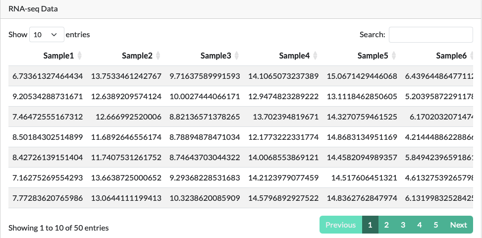
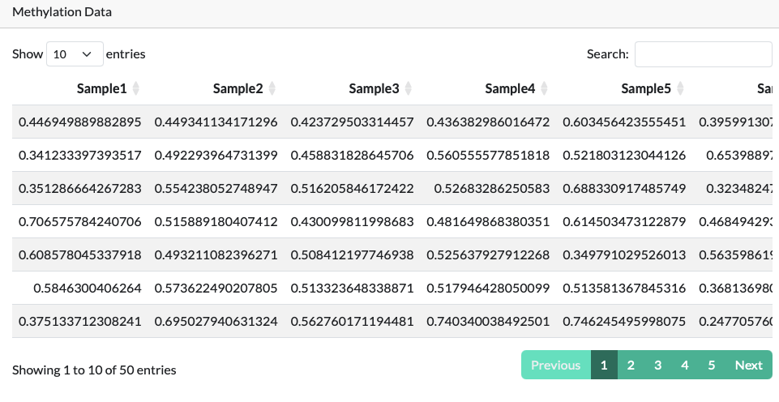
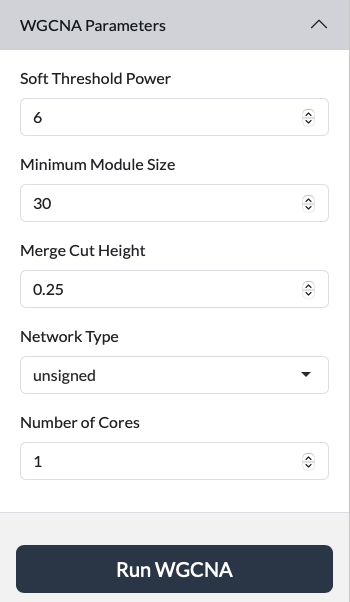
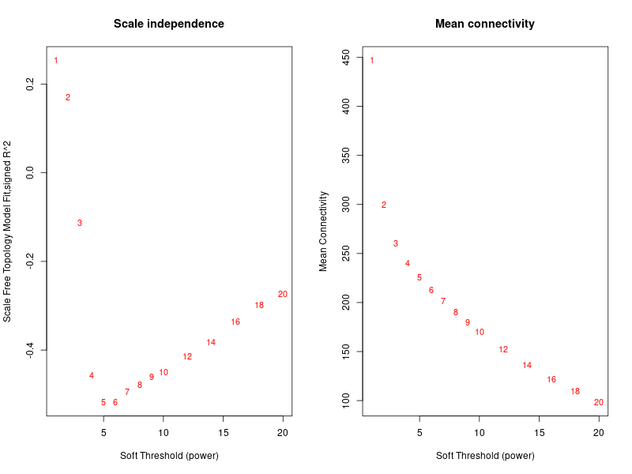
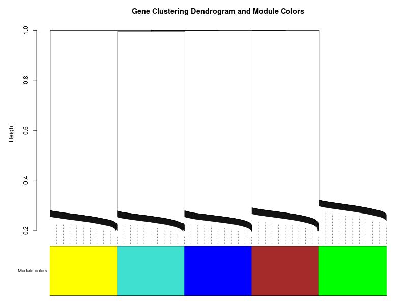

# Shiny-WGCNA Tutorials
## Chapter 1: Data Upload

The first and most critical step in using the Shiny-WGCNA application is to prepare and upload your data. The application is designed to work with two specific types of files, both in CSV format.

Open your web browser and navigate to the following URL:
<a href="https://shinywgcna.serve.scilifelab.se/app/shinywgcna" target="_blank" rel="noopener">https://shinywgcna.serve.scilifelab.se/</a>

### 1.1 Gene Expression Data

This file contains the core data for the WGCNA analysis.

- **Format:** A comma-separated values (.csv) file.
- **Structure:**
  - **Rows:** Each row represents a gene.
  - **Columns:** Each column represents a sample (or biological replicate).
  - **First Column:** This column must contain unique gene identifiers (e.g., gene symbols, Ensembl IDs, etc.). This column should have a header name.
  - **Remaining Columns:** These columns should contain the gene expression values for each sample.

### 1.2 DNA Methylation (Sample Trait) Data
You can optionally upload a second CSV file containing information about your samples. This is essential for correlating gene modules with phenotypic traits.

- **Format:** A comma-separated values (.csv) file.
- **Structure:**
  - **Rows:** Each row represents a sample.
  - **Columns:** Each column represents a trait (e.g., treatment group, disease status, time point, etc.).
  - **First Column:** This column must contain the sample names, which must exactly match the column headers of your gene expression data file.

### 1.3 Uploading Your Files

Use the file upload controls within the app to select your gene expression and sample trait files. The application will then load this data for the analysis.

??? note "Demo Data Download"
    Please download the demo data from the following link to practice with the olinkWrapper app: <a href="https://sourceforge.net/projects/shinywgcna/files/" target="_blank" rel="noopener">https://sourceforge.net/projects/shinywgcna/files/</a>

    **Remember: download both files.**

### 1.4 Input Preview
After successfully uploading your data, the "Input Preview" tab will automatically display a snapshot of your gene expression data table.

- **Purpose:** This tab serves as a confirmation step, allowing you to quickly verify that your data has been uploaded correctly and that the format is as expected.

- **What to Check:**
  - Ensure that the gene names in the first column appear correctly.
  - Confirm that the sample headers are correct.
  - Visually inspect a few rows to ensure the expression values are loaded properly.

- **Data Integrity:** If there are any issues with the data format or structure, the app will provide error messages to guide you in correcting them.

### Running the Analysis

#### Parameters setup

## Chapter 2: Soft Thresholding Power
The "Soft Threshold" tab is one of the most important steps in the WGCNA analysis. It helps you choose the correct soft thresholding power (β), a parameter that determines the network's topology.

### 2.1 How it Works: 
The app generates two key plots:

#### 2.1.1 Scale-Free Topology Fit Index vs. Soft Threshold: 
This plot shows how well the network fits a scale-free topology for various β values. You are looking for a value where the curve starts to plateau.

#### 2.1.2 Mean Connectivity vs. Soft Threshold: 
This plot shows the average connectivity of the network. A stable or low connectivity is often desired to avoid creating a very dense network that is difficult to interpret.

Use the plots to select an appropriate β value. A common practice is to choose the smallest β value that results in a high scale-free topology fit (e.g., > 0.85).

## Chapter 3: Gene Clustering Dendrogram
Once the network has been built, the "Gene Clustering Dendrogram" tab displays the hierarchical clustering of genes.

### 3.1 Purpose
This visualization shows how genes are grouped together based on their co-expression similarity. Each branch of the dendrogram represents a cluster of genes.

### 3.2 Module Identification
The app automatically uses a dynamic tree cut algorithm to identify distinct modules, which are represented by different colors along the bottom of the dendrogram. Genes within the same module are highly co-expressed with each other.

## 4. Module-Trait Correlation
This tab provides a heatmap that summarizes the relationship between your identified gene modules and the sample traits you provided.

### 4.1 Purpose
This is a powerful tool for identifying which gene modules are most strongly associated with your biological questions (e.g., disease status, treatment response).

### 4.2 How to Read the Heatmap

- **Rows:** Represent the different modules (e.g., MEbrown, MEblue).
- **Columns:** Represent the sample traits.
- **Colors:** The color intensity and shade (red for positive, blue for negative) indicate the strength of the correlation. A darker color signifies a stronger correlation.
- **Numbers:** Each cell contains two numbers: the correlation coefficient and the corresponding p-value. A low p-value (e.g., < 0.05) indicates a statistically significant correlation.

## 5. Network Heatmap
The "Network Heatmap" tab provides a visual representation of the topological overlap matrix (TOM) within your network.

### 5.1 Purpose
The TOM represents the interconnectedness of genes. This heatmap provides a quick visual check on the modular structure of your network.

### 5.2 How to Read the Heatmap:

- **Genes:** Both the rows and columns represent the same set of genes.
- **Clustering:** Genes that are highly connected to each other will cluster together, forming distinct squares or rectangles along the diagonal.
- **Colors:** The intensity of the color indicates the level of topological overlap. Darker colors represent higher overlap and stronger connections between genes.

## 6. Gene Significance & Module Membership Scatter Plot
This tab generates a scatter plot that shows the relationship between two important metrics for each gene:

- **Gene Significance (GS):** This measures the correlation of a gene's expression profile with a specific sample trait.
- **Module Membership (MM):** This measures how well a gene is connected to the other genes within its assigned module.

### 6.1 How to Interpret
Genes that have both high Gene Significance (strong correlation with a trait) and high Module Membership (are central to their module) are considered hub genes. These genes are often the most biologically relevant and are excellent candidates for further investigation.

