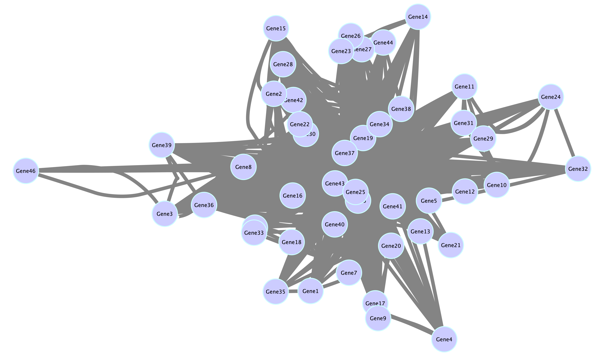

# Cytoscape Tutorial for WGCNA Networks
After performing a Weighted Gene Co-expression Network Analysis (WGCNA) in R, you'll have a network of genes and their connections (edges), often grouped into modules (nodes). While R's plotting capabilities are useful, Cytoscape is the gold standard for creating publication-quality, interactive network visualizations. This tutorial will guide you through the process of taking your WGCNA results and importing them into Cytoscape.

## 1. Step 1: Exporting Network Data from R

The `WGCNA` package includes a dedicated function, `exportNetworkToCytoscape`, which simplifies this process. It takes your adjacency matrix and module color assignments and generates two plain text files that Cytoscape can easily read: a node file and an edge file.

For this example, we'll assume you have already run a WGCNA analysis and have the following objects:

- `adjMat`: Your adjacency matrix.
- `moduleColors`: A vector of colors assigned to each gene module.
- `geneNames`: A vector of the gene names or IDs.

Here is the R code to create these files. You should run this code after your WGCNA analysis is complete.
```R
# --- Dummy data for demonstration purposes ---
# In a real analysis, you would use your actual WGCNA results.
# Generate a small, fake adjacency matrix (a symmetric matrix of connection strengths)
set.seed(42)
num_genes <- 50
adjMat <- matrix(runif(num_genes * num_genes), nrow = num_genes)
adjMat <- (adjMat + t(adjMat)) / 2
diag(adjMat) <- 0

# Assign genes to three fake modules (red, blue, green)
moduleColors <- sample(c("red", "blue", "green"), num_genes, replace = TRUE)

# Create fake gene names
geneNames <- paste0("Gene_", 1:num_genes)
# --- End of dummy data section ---

# Install the WGCNA package if you haven't already
if (!requireNamespace("WGCNA", quietly = TRUE)) {
  install.packages("WGCNA")
}
library(WGCNA)

# Export the network to two files for Cytoscape
cytoscape_files <- exportNetworkToCytoscape(
  adjMat,                                  # Your adjacency matrix
  weighted = TRUE,                         # Use weighted connections
  threshold = 0.2,                         # Only export connections above this weight
  nodeNames = geneNames,                   # Node names (gene names)
  nodeAttr = moduleColors                  # Node attributes (module color)
)

# You can save the files to a specific location if you want.
# write.csv(cytoscape_files$edgeData, "WGCNA_edges.csv", row.names = FALSE)
# write.csv(cytoscape_files$nodeData, "WGCNA_nodes.csv", row.names = FALSE)

# The function will also return the data frames, which you can save or inspect.
edge_data <- cytoscape_files$edgeData
node_data <- cytoscape_files$nodeData

# Print the first few rows of each data frame to see the format
print("Edge data (connections):")
print(head(edge_data))
print("Node data (genes and attributes):")
print(head(node_data))
```

## 2. Step 2: Importing the Network into Cytoscape

Now, open Cytoscape and follow these steps to import your network files.

1. **Start a new session:** In Cytoscape, go to `File -> New -> Network -> From File....`
2. **Import the edge file:** A file browser will pop up. Select the edge file (`WGCNA_edges.csv` or similar) that you created in the previous step.
3. **Configure the import:** A new window will appear, asking you to configure the network import. This is a crucial step!

- Under **"Source Interaction"**, select the column containing the source node (e.g., `fromNode`).
- Under **"Target Interaction"**, select the column with the target node (e.g., `toNode`).
- Under **"Edge Attributes"**, select the weight column. This is what will determine the thickness of the lines between your nodes.
- Click **"OK"** Your network should now appear in the main Cytoscape window.

4. **Import the node file:** To add the module colors to your network, go to `File -> Import -> Table from File....`
5. **Configure the import:** Select the node file (`WGCNA_nodes.csv` or similar). In the import window, make sure the **"Key"** column is set to your gene names (nodeName in the file) and is mapped to the "Node Name" attribute in Cytoscape. This links the gene data to the corresponding nodes in your network. Click **"OK"**.

## 3. Step 3: Visualizing and Styling the Network

Your network is now in Cytoscape, but it might look like a "hairball" with all the nodes overlapping. Now is the time to make it visually informative.

1. **Apply a layout:** On the left-hand panel, go to the `Layout` tab and choose a layout algorithm. For gene networks, the `Prefuse Force Directed Layout` is a great place to start.

2. **Style your nodes:** Go to the `Style` tab on the left.

- **Node Color:** Click the `Fill Color` icon. A new panel will open. Click on "Column" and select the `moduleColors` column. Cytoscape will automatically assign a unique color to each module.
- **Node Size:** You can also use other data attributes to change the node size. For example, you could map `hub` score (a measure of how central a gene is) to the node size to highlight important genes.

3. **Style your edges:** While still in the `Style` tab, switch to the `Edge` tab at the top.

- **Edge Thickness:** Click on the `Width` icon and map it to the `weight` attribute. Now, the strongest connections will appear as thicker lines.
- **Edge Color:** You can also map edge color to the `weight` to create a smooth gradient from weak (e.g., light gray) to strong (e.g., black) connections.

