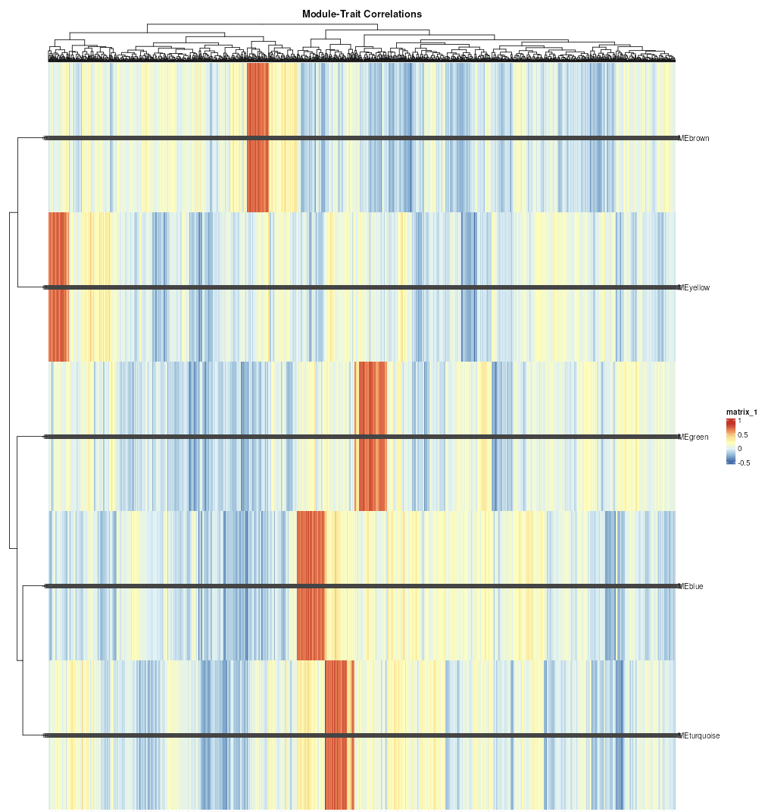

# Module-Trait Correlation
This tab provides a heatmap that summarizes the relationship between your identified gene modules and the sample traits you provided.

## Purpose
This is a powerful tool for identifying which gene modules are most strongly associated with your biological questions (e.g., disease status, treatment response).

## How to Read the Heatmap

- **Rows:** Represent the different modules (e.g., MEbrown, MEblue).
- **Columns:** Represent the sample traits.
- **Colors:** The color intensity and shade (red for positive, blue for negative) indicate the strength of the correlation. A darker color signifies a stronger correlation.
- **Numbers:** Each cell contains two numbers: the correlation coefficient and the corresponding p-value. A low p-value (e.g., < 0.05) indicates a statistically significant correlation.

