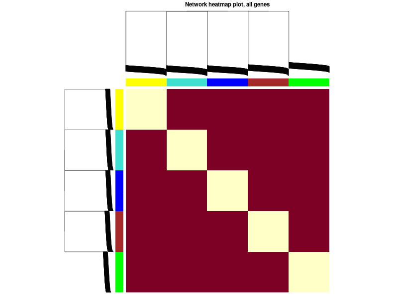

# Network Heatmap
The "Network Heatmap" tab provides a visual representation of the topological overlap matrix (TOM) within your network.

## Purpose
The TOM represents the interconnectedness of genes. This heatmap provides a quick visual check on the modular structure of your network.

## How to Read the Heatmap:

- **Genes:** Both the rows and columns represent the same set of genes.
- **Clustering:** Genes that are highly connected to each other will cluster together, forming distinct squares or rectangles along the diagonal.
- **Colors:** The intensity of the color indicates the level of topological overlap. Darker colors represent higher overlap and stronger connections between genes.

