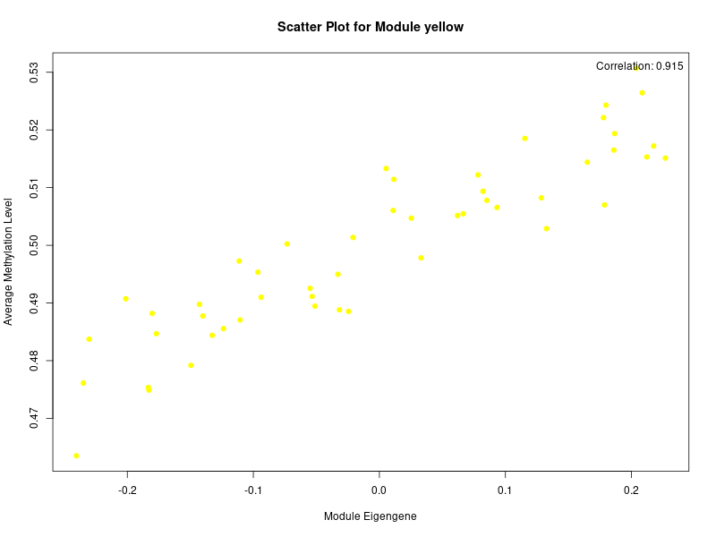
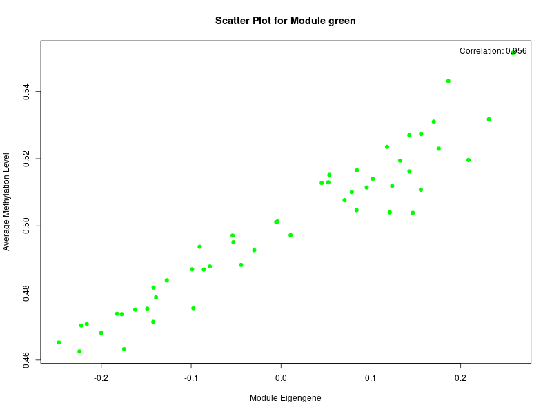
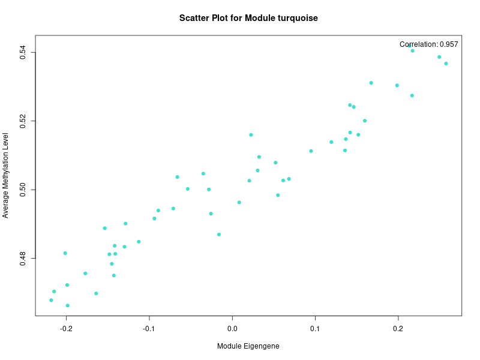
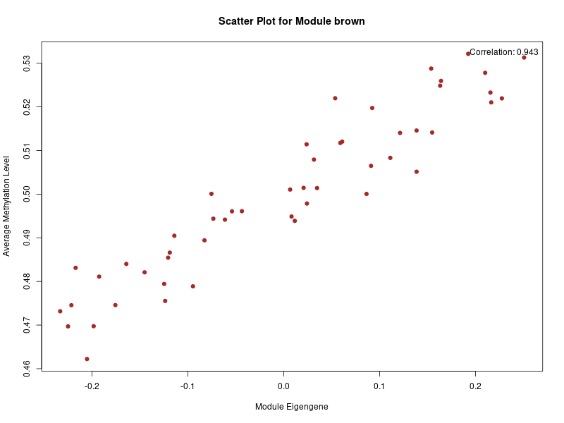
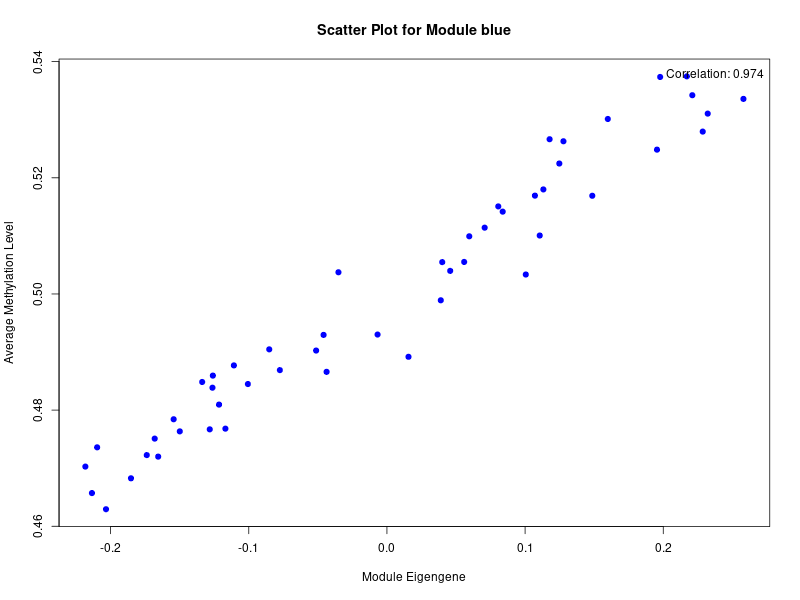

# Gene Significance & Module Membership Scatter Plot
This tab generates a scatter plot that shows the relationship between two important metrics for each gene:

- **Gene Significance (GS):** This measures the correlation of a gene's expression profile with a specific sample trait.
- **Module Membership (MM):** This measures how well a gene is connected to the other genes within its assigned module.

## How to Interpret
Genes that have both high Gene Significance (strong correlation with a trait) and high Module Membership (are central to their module) are considered hub genes. These genes are often the most biologically relevant and are excellent candidates for further investigation.

