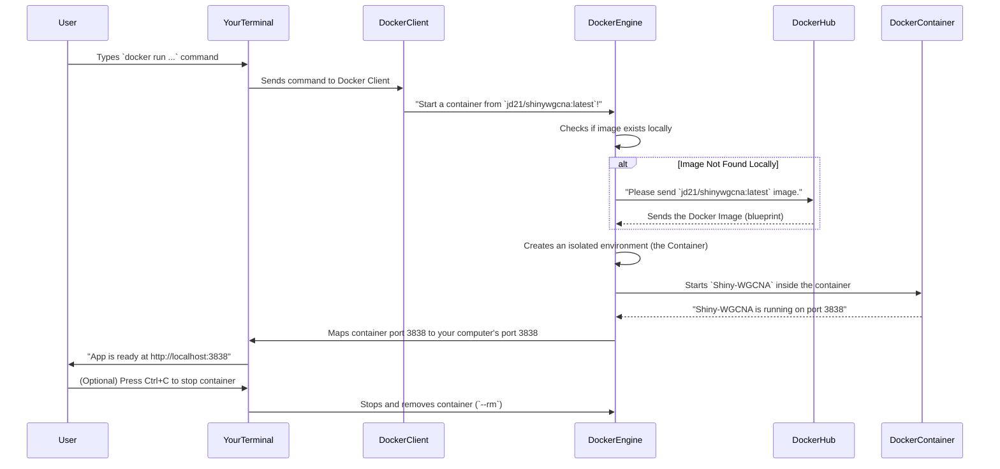

# Chapter 7: Docker Containerization

In the [previous chapter](chapter6.md), we wrapped up our exploration of `Shiny-WGCNA` by understanding how to export your valuable analysis results and visualizations. You've learned how to upload data, run complex analyses, view insightful plots, and save everything for further use or sharing. That's a complete workflow!

But imagine this: you've successfully installed R, all the necessary R packages (like `shiny` and `WGCNA`), and got `Shiny-WGCNA` running perfectly on your computer. Now, a colleague in another lab wants to use it. They might have a different operating system (like Linux instead of Windows), an older version of R, or just don't want to spend hours installing all the specific R packages and their dependencies. How do you make it super easy for them to get `Shiny-WGCNA` up and running, exactly as it works on your machine, without any compatibility headaches?

This is where **Docker Containerization** comes in! It's a powerful and elegant solution that solves the common problem of "it works on my machine, but not on yours."

### What Problem Does Docker Containerization Solve?

Think of `Shiny-WGCNA` as a complex appliance, like a high-tech microwave. It needs electricity (an operating system), specific parts (R and its libraries), and the actual cooking mechanism (your `Shiny-WGCNA` app code).

Traditionally, if you wanted to give your friend a microwave, you'd have to send them:
1.  All the individual components (wires, metal sheets, electronic boards).
2.  Instructions on how to assemble it.
3.  A specific power supply.
This is tedious and prone to errors (what if they use the wrong wire, or their power supply is different?).

The problem Docker Containerization solves is this: **ensuring that `Shiny-WGCNA` (or any software) runs consistently and reproducibly on *any* computer, without complex setup or dependency conflicts.**

Docker allows us to package the entire `Shiny-WGCNA` application – along with its operating system, the exact R version it needs, and *all* the required R libraries – into a lightweight, portable, and self-sufficient unit. This unit is called a **Docker Image**. When you run a Docker Image, it becomes a **Docker Container**, which is a complete, ready-to-use, isolated environment for your app.

It's like shipping a complete, ready-to-use microwave directly to your friend. They just plug it in, and it works, no assembly required!

### Key Concepts of Docker Containerization

To understand Docker, let's break down a few key terms:

| Concept           | Analogy (Microwave)                               | What it means for `Shiny-WGCNA`                                                                                                      |
| :---------------- | :------------------------------------------------ | :----------------------------------------------------------------------------------------------------------------------------------- |
| **Docker**        | The delivery service that handles microwaves.     | A tool that allows you to build, run, and manage containers.                                                                         |
| **Containerization** | The act of packaging the microwave neatly.        | The strategy of bundling an application and all its dependencies into an isolated, self-sufficient unit.                             |
| **Docker Image**  | The blueprint or recipe for a specific microwave model. | A lightweight, standalone, executable package that includes everything needed to run `Shiny-WGCNA`: code, runtime, system tools, libraries, and settings. It's read-only. |
| **Docker Container** | An actual, running microwave, built from the blueprint. | A runnable instance of a Docker Image. You can start, stop, move, or delete a container. It's an isolated environment where `Shiny-WGCNA` runs. |
| **Dockerfile**    | The instruction manual for building the microwave. | A simple text file that contains all the commands needed to automatically build a Docker Image. (We'll look at this very briefly). |

### How to Use Docker to Run `Shiny-WGCNA` (The Use Case Solution)

Let's imagine your friend, who has Docker installed on their computer, wants to run `Shiny-WGCNA`. They don't need to install R or any R packages. They just need one command!

**Prerequisite:** Make sure you have [Docker Desktop](https://www.docker.com/products/docker-desktop/) (or Docker Engine) installed on your computer.

**The Magic Command:**
Open your computer's command line or terminal and type:

```bash
docker run --rm -p 3838:3838 jd21/shinywgcna:latest
```

**What happens after you run this command:**
1.  **Docker fetches the Image:** Docker checks if it already has the `jd21/shinywgcna:latest` image downloaded on your computer. If not (first time running), it automatically downloads it from Docker Hub (a public registry of Docker Images). This is like your delivery service getting the specific microwave model from the warehouse.
2.  **Docker creates a Container:** Once the image is available, Docker creates a new isolated container from it.
3.  **`Shiny-WGCNA` starts:** Inside this container, `Shiny-WGCNA` starts running, just as it would if you ran `shiny::runApp("app.R")` directly on a computer with R installed.
4.  **Access in your browser:** The `-p 3838:3838` part of the command tells Docker to connect the app's internal port (3838) to your computer's port (3838). This means you can open your web browser and go to `http://localhost:3838`. You will see `Shiny-WGCNA` running!

This single command allows anyone with Docker to run `Shiny-WGCNA` without any manual setup of R or its libraries. It's incredibly convenient, especially for sharing complex bioinformatics tools! The `README.md` for `Shiny-WGCNA` shows this exact command:

```
docker run --rm -p 3838:3838 jd21/shinywgcna:latest
```

### Behind the Scenes: How Docker Works Its Magic

When you run that `docker run` command, a lot is happening in the background to make `Shiny-WGCNA` available to you.



**The Dockerfile: The Recipe for the Image**

So, where does that `jd21/shinywgcna:latest` image come from? It's built from a special text file called a `Dockerfile`. This file contains step-by-step instructions on how to assemble the `Shiny-WGCNA` "microwave."

Here's a simplified idea of what instructions a `Dockerfile` for `Shiny-WGCNA` might contain (this is not the actual `Dockerfile` for `Shiny-WGCNA`, but a conceptual example):

```dockerfile
# Start from a base image that already has R installed
FROM r-base:latest

# Install system dependencies needed by R packages
RUN apt-get update && apt-get install -y --no-install-recommends \
    libxml2-dev \
    # ... more system dependencies ...

# Install R packages needed for Shiny-WGCNA
RUN R -e "install.packages(c('shiny', 'WGCNA', 'DT', 'pheatmap', 'shinyjs', 'bslib', 'tidyverse', 'jsonlite', 'rhandsontable'), repos='https://cloud.r-project.org/')"

# Copy your Shiny-WGCNA application files into the image
COPY app/ /app/

# Set the working directory inside the container
WORKDIR /app

# Tell Docker that the application listens on port 3838
EXPOSE 3838

# Command to run when the container starts
CMD ["R", "-e", "shiny::runApp('/app', host='0.0.0.0', port=3838)"]
```

**Explanation of the (conceptual) Dockerfile:**
*   `FROM r-base:latest`: This line tells Docker to start with a pre-built image that already has R installed. It's like saying, "Start with a basic framework."
*   `RUN ...`: These lines execute commands inside the image during the build process. Here, it installs any operating system libraries and then all the necessary R packages (like `shiny`, `WGCNA`, `DT`, etc.) that `Shiny-WGCNA` depends on.
*   `COPY app/ /app/`: This line copies all the files for your `Shiny-WGCNA` application (your `app.R`, `ui` folder, `server` folder, etc.) from your computer into the `/app` directory inside the Docker Image.
*   `WORKDIR /app`: Sets the default directory when the container starts.
*   `EXPOSE 3838`: Informs Docker that the application inside the container will use port 3838.
*   `CMD [...]`: This is the command that gets executed automatically when a container is launched from this image. It runs the Shiny application.

The `README.md` also shows how the `docker-image.yml` file in the `.github/workflows` directory is used with GitHub Actions to *automatically build and publish* this Docker image whenever changes are pushed to the project. This ensures that the `latest` image is always up-to-date.

```yaml
# .github/workflows/docker-image.yml (simplified Build and Push step)
- name: Build and push
  uses: docker/build-push-action@v6
  with:
    context: . # Looks for a Dockerfile in the current directory
    push: true # Uploads the image to Docker Hub
    tags: |
      ${{ steps.meta.outputs.tags }}
      jd21/shinywgcna:latest # Tags the image as 'jd21/shinywgcna:latest'
```
This automated process is how the `jd21/shinywgcna:latest` image becomes available on Docker Hub for everyone to easily download and run.

### Conclusion

Docker Containerization is the ultimate solution for sharing and deploying `Shiny-WGCNA` (and other software) effortlessly. By packaging the entire application and its environment into a self-contained unit, it eliminates compatibility issues, simplifies setup, and ensures that your bioinformatics tool works consistently, reliably, and reproducibly, no matter where it's used. You've now seen how `Shiny-WGCNA` is built from the ground up, from its interactive interface and powerful analytical engine to its robust data management, insightful visualizations, flexible export options, and finally, its seamless deployment via Docker.