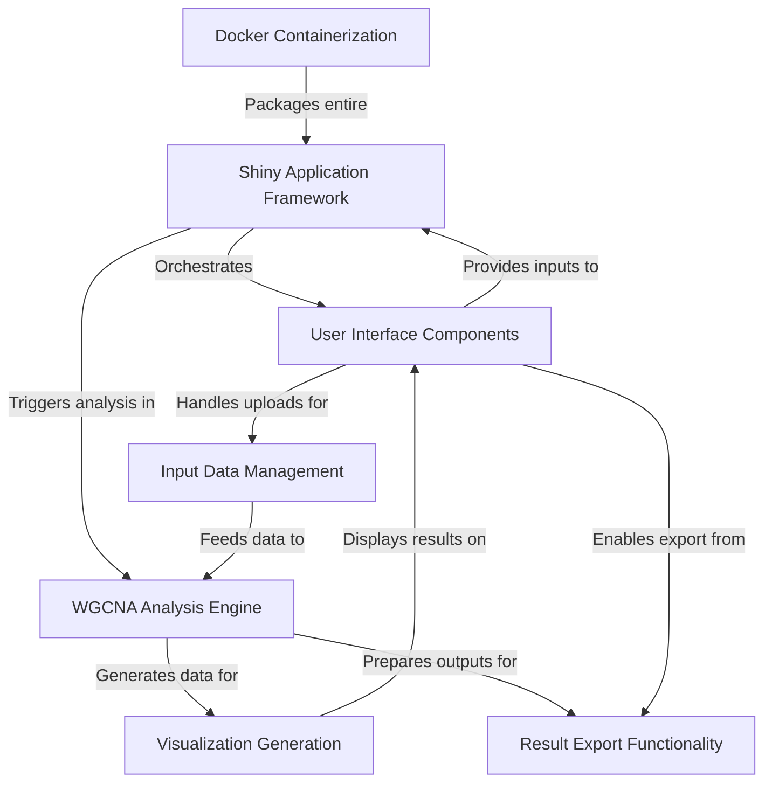

# Tutorial: Shiny-WGCNA

This project, `Shiny-WGCNA`, offers a user-friendly **interactive web application** for performing
*Weighted Gene Co-expression Network Analysis (WGCNA)*. It enables users to **upload biological data**
(like RNA-seq and DNA methylation), customize analysis parameters, generate various **visualizations**
of gene networks, and easily **export** the comprehensive results.

## Visual Overview

## Chapters

1. [Manual](chapter1.md)
2. [Theory](chapter2.md)
3. [WGCNA and Cytoscape](chapter3.md)

